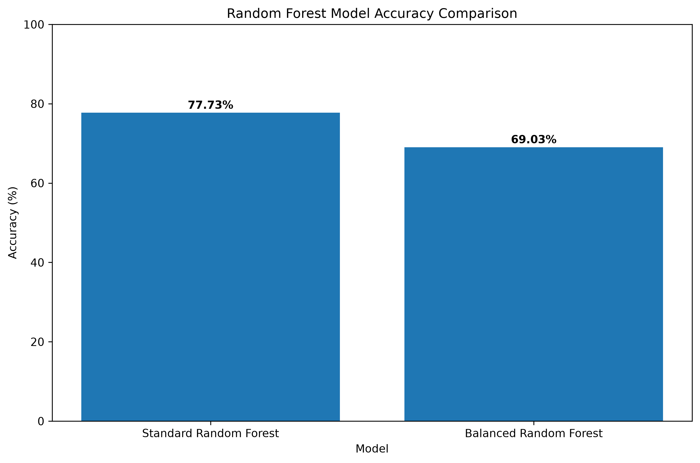
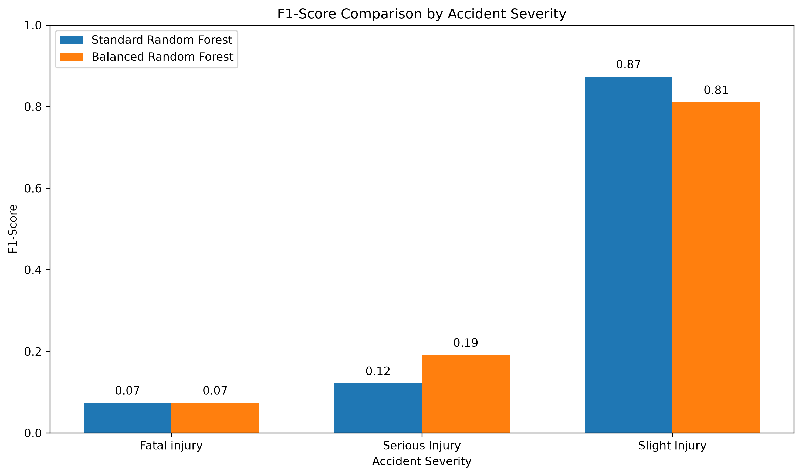

# DATA-TRAINING — Accident Severity Prediction

## 📊 Project Overview

This project is a Python-based machine learning project developed as part of my **Data Science Programming** studies.

The project uses a **Road Traffic Accident (RTA) dataset** to analyze accident-related information and predict **accident severity** based on factors such as driver age group, weather conditions, road surface conditions, vehicle movement, time, and the reported cause of the accident.

The project demonstrates the process of preparing real-world data, performing exploratory data analysis, training machine learning models, evaluating their performance, and comparing different approaches to handling class imbalance.

---

## 🎯 Objectives

The main objectives of this project are to:

- Explore and understand a real-world road traffic accident dataset.
- Clean and prepare data for machine learning.
- Convert time information into a numerical format.
- Process categorical variables using encoding techniques.
- Perform exploratory data analysis using visualizations.
- Split the dataset into training and testing sets.
- Train machine learning models to predict accident severity.
- Evaluate model performance using accuracy, precision, recall, and F1-score.
- Compare standard and balanced machine learning approaches.
- Make predictions using hypothetical accident information.
- Save the trained model for future use.

---

## 🧠 Machine Learning Models

Two **Random Forest Classifiers** were evaluated:

1. **Standard Random Forest**
2. **Balanced Random Forest**

The Standard Random Forest was used as the primary model because it achieved the highest overall accuracy.

The Balanced Random Forest was tested to determine whether class weighting could improve the detection of minority classes such as Fatal Injury and Serious Injury.

---

## 🔍 Selected Features

The models use the following features:

- Time
- Age band of driver
- Weather conditions
- Cause of accident
- Road surface conditions
- Vehicle movement

### Target Variable

**Accident severity**

The target variable contains three categories:

- Fatal Injury
- Serious Injury
- Slight Injury

---

## 🛠️ Technologies Used

- **Python**
- **Pandas** — data manipulation and analysis
- **Scikit-learn** — machine learning and model evaluation
- **Matplotlib** — data visualization
- **Joblib** — model persistence
- **CSV** — dataset format

---

## 🔄 Project Workflow

```text
Data Collection
      ↓
Data Loading
      ↓
Data Cleaning
      ↓
Feature Selection
      ↓
Time Conversion
      ↓
Categorical Data Encoding
      ↓
Exploratory Data Analysis
      ↓
Train/Test Split
      ↓
Random Forest Model Training
      ↓
Model Evaluation
      ↓
Model Comparison
      ↓
Accident Severity Prediction
      ↓
Model Saving
```

---

# 📈 Exploratory Data Analysis

Visualizations were created using **Python and Matplotlib** to understand patterns within the accident dataset.

## 1. Accident Severity Distribution

This chart shows the distribution of accidents across the different severity categories.


---

## 2. Accidents by Weather Condition

This visualization shows the number of recorded accidents under different weather conditions.


---

## 3. Accidents by Driver Age Group

This chart shows the distribution of accidents across different driver age groups.


---

## 4. Accident Severity by Weather Condition

This visualization compares accident severity across different weather conditions.


---

# 📊 Dataset Information

The original dataset contained:

**12,316 records**

After removing rows containing missing values:

**12,008 records remained**

The cleaned dataset was divided into:

| Dataset | Records |
|---|---:|
| Training Data | 9,606 |
| Testing Data | 2,402 |

The dataset was divided using an **80/20 train-test split**.

---

# 🤖 Primary Model Results

The Standard Random Forest model achieved an overall accuracy of:

## **77.73%**

### Classification Results

| Accident Severity | Precision | Recall | F1-Score |
|---|---:|---:|---:|
| Fatal Injury | 0.08 | 0.07 | 0.07 |
| Serious Injury | 0.15 | 0.10 | 0.12 |
| Slight Injury | 0.85 | 0.90 | 0.87 |
| **Overall Accuracy** | | | **77.73%** |

### Interpretation

The Standard Random Forest performed strongest when identifying **Slight Injury** cases, which represent the majority of records in the dataset.

However, the model performed considerably worse for **Fatal Injury** and **Serious Injury** cases.

This indicates that the dataset contains significant **class imbalance**, with substantially more Slight Injury cases than Fatal Injury and Serious Injury cases.

Therefore, accuracy should not be considered the only measure of model performance. Precision, recall, and F1-score provide additional information about how well the model handles each accident severity category.

---

# ⚖️ Accident Severity Distribution

After preprocessing, the accident severity distribution was:

| Accident Severity | Number of Records |
|---|---:|
| Slight Injury | 10,167 |
| Serious Injury | 1,689 |
| Fatal Injury | 152 |
| **Total** | **12,008** |

The large difference between the classes explains why the model performs considerably better on Slight Injury cases.

---

# 🔬 Model Comparison

To investigate the effect of class imbalance, two Random Forest approaches were evaluated:

### Standard Random Forest

The standard model treats the training examples normally without applying class weights.

### Balanced Random Forest

The balanced model uses:

```python
class_weight="balanced"
```

This gives greater importance to minority classes during model training.

---

## 📊 Model Performance Comparison

| Model | Accuracy | Fatal Injury F1 | Serious Injury F1 | Slight Injury F1 |
|---|---:|---:|---:|---:|
| **Standard Random Forest** | **77.73%** | 0.07 | 0.12 | **0.87** |
| Balanced Random Forest | 69.03% | 0.07 | **0.19** | 0.81 |

---

## 📈 Accuracy Comparison

The Standard Random Forest achieved **77.73%** overall accuracy, while the Balanced Random Forest achieved **69.03%**.



The Standard Random Forest therefore achieved **8.70 percentage points higher overall accuracy**.

---

## 📉 F1-Score Comparison

The F1-score comparison demonstrates the trade-off between overall accuracy and minority-class performance.

The Balanced Random Forest improved the F1-score for **Serious Injury** from **0.12 to 0.19**.



Although the Balanced Random Forest improved performance for the Serious Injury class, it reduced performance for Slight Injury and resulted in lower overall accuracy.

---

## 💡 Model Comparison Interpretation

The results demonstrate an important trade-off between **overall accuracy** and **minority-class performance**.

### Standard Random Forest

- Overall accuracy: **77.73%**
- Strong performance on Slight Injury cases.
- Highest overall accuracy.
- Selected as the primary model.

### Balanced Random Forest

- Overall accuracy: **69.03%**
- Improved Serious Injury F1-score.
- Slightly improved Fatal Injury recall.
- Reduced performance on Slight Injury cases.

For this project, the **Standard Random Forest is retained as the primary model** because it achieved the highest overall accuracy.

However, the Balanced Random Forest experiment demonstrates that class balancing can improve the detection of certain minority classes.

---

# 🔮 Example Prediction

The trained model was tested using a hypothetical accident scenario with the following characteristics:

- **Time:** 10:00 AM
- **Driver age band:** 18–30
- **Weather:** Normal
- **Cause:** No distancing
- **Road surface:** Dry
- **Vehicle movement:** Going straight

### Prediction

**Predicted Accident Severity: Serious Injury**

---

# 💾 Model Persistence

The trained machine learning model can be saved using **Joblib**.

The project generates:

```text
accident_severity_model.pkl
```

This allows the trained model to be reused without retraining it from the beginning.

---

# 📁 Repository Contents

| File | Description |
|---|---|
| `accident_severity.py` | Main Python program for data preparation, model training, evaluation, prediction, and visualization |
| `model_comparison.py` | Compares Standard and Balanced Random Forest models |
| `RTA Dataset.csv.zip` | Road traffic accident dataset used for the project |
| `Accident Severity.docx` | Project documentation and report |
| `README.md` | Project documentation and overview |
| `accident_severity_distribution.png` | Accident severity distribution chart |
| `accidents_by_weather.png` | Accident distribution by weather condition |
| `accidents_by_driver_age.png` | Accident distribution by driver age group |
| `accident_severity_by_weather.png` | Accident severity comparison by weather |
| `model_accuracy_comparison.png` | Accuracy comparison between the two models |
| `model_f1_score_comparison.png` | F1-score comparison between the two models |

---

# 💻 How to Run the Project

## 1. Install Python

Check that Python is installed:

```bash
python --version
```

---

## 2. Install Required Libraries

Run:

```bash
pip install pandas scikit-learn joblib matplotlib
```

---

## 3. Run the Main Program

From the project directory:

```bash
python accident_severity.py
```

The program will:

- Load the dataset.
- Clean the data.
- Generate visualizations.
- Train the Random Forest model.
- Evaluate the model.
- Make an example prediction.
- Save the trained model.

---

## 4. Run Model Comparison

To compare the Standard and Balanced Random Forest models:

```bash
python model_comparison.py
```

This generates:

```text
model_accuracy_comparison.png
model_f1_score_comparison.png
```

---

# 💡 Skills Demonstrated

This project provided practical experience in:

- Python programming
- Data preprocessing
- Data cleaning
- Exploratory data analysis
- Data visualization
- Feature selection
- Categorical data encoding
- Machine learning classification
- Random Forest
- Class imbalance analysis
- Train/test splitting
- Model comparison
- Precision, recall, and F1-score
- Confusion matrix analysis
- Model persistence using Joblib
- Working with real-world datasets

---

# 🚀 Future Improvements

Future versions of the project could include:

- Comparing additional machine learning algorithms.
- Performing hyperparameter tuning.
- Using cross-validation.
- Applying advanced techniques to address class imbalance.
- Experimenting with SMOTE and other resampling methods.
- Adding more relevant accident features.
- Improving prediction performance for Fatal Injury cases.
- Performing feature importance analysis.
- Developing an interactive web interface for accident severity prediction.
- Deploying the trained model as an API.
- Creating a dashboard for accident analysis.

---

# 📚 Data Source

The dataset used in this project is a **Road Traffic Accident (RTA) dataset obtained from Kaggle** and is used for educational and machine learning purposes.

---

# 👨‍💻 Author

**Halcion Muthuri**

Software Engineering Student  
**Zetech University, Kenya**

---

# ⚠️ Disclaimer

This project was developed for **academic and learning purposes**.

The predictions produced by this model should not be considered a substitute for professional road-safety analysis, official accident investigation, or emergency decision-making.

---

⭐ **Thank you for visiting this project!**

If you find this project useful, feel free to explore the code, visualizations, and model comparison experiments.
