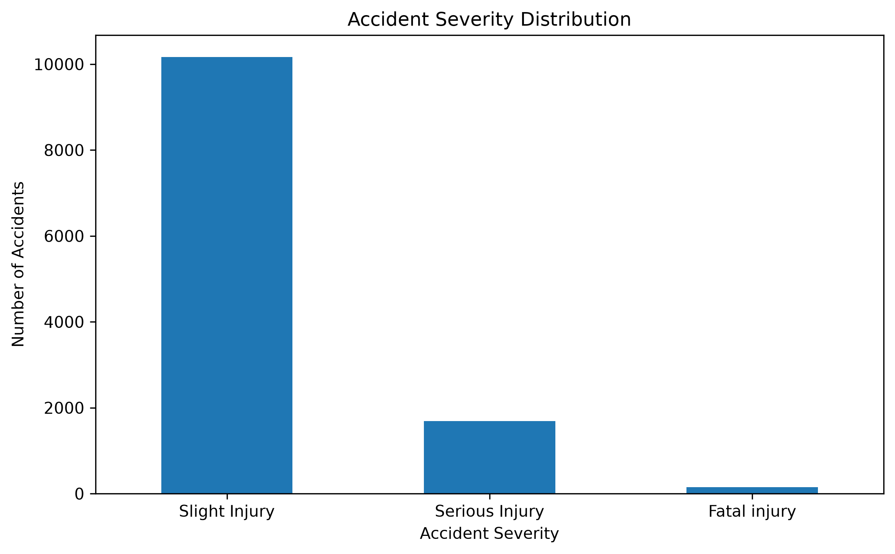
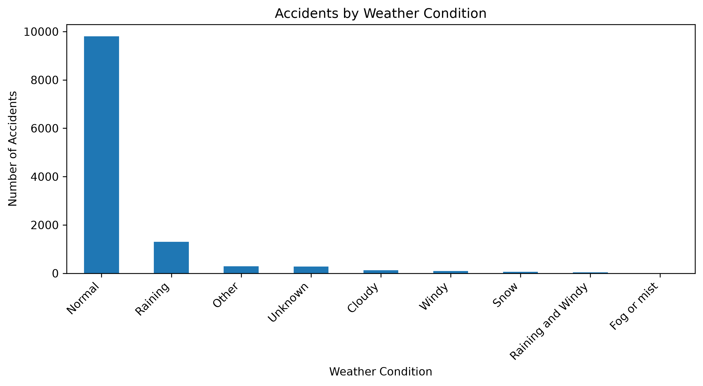
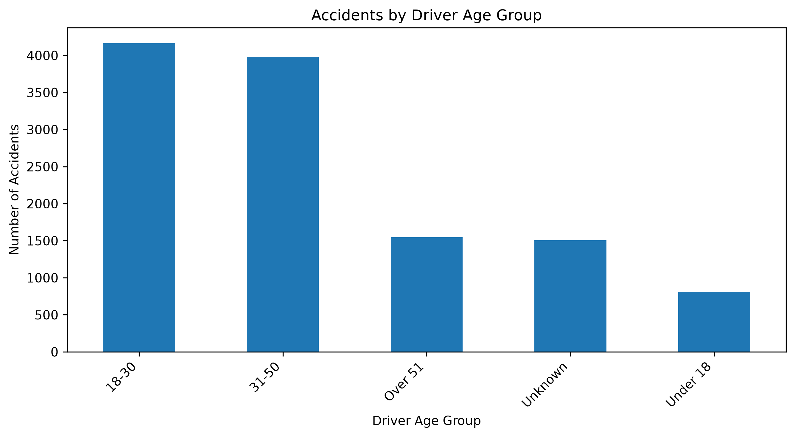
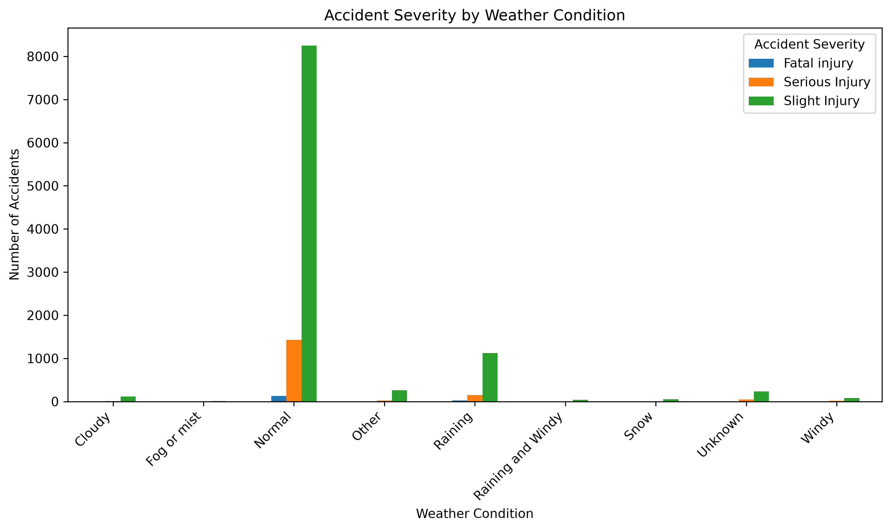

# DATA-TRAINING — Accident Severity Prediction

## 📊 Project Overview

This project is a Python-based machine learning project developed as part of my **Data Science Programming** studies.

The project uses a **Road Traffic Accident (RTA) dataset** to analyze accident-related information and predict **accident severity** based on selected factors such as driver age group, weather conditions, road surface conditions, vehicle movement, time, and the reported cause of the accident.

The project demonstrates the process of preparing real-world data and applying machine learning techniques to a classification problem.

---

## 🎯 Objectives

The main objectives of this project are to:

* Explore and understand a real-world road traffic accident dataset.
* Clean and prepare data for machine learning.
* Convert time information into a numerical format.
* Process categorical variables using encoding techniques.
* Split the dataset into training and testing sets.
* Train a machine learning model to predict accident severity.
* Evaluate the performance of the trained model.
* Make predictions using hypothetical accident information.
* Save the trained model for future use.

---

## 🧠 Machine Learning Model

The project uses a **Random Forest Classifier** to predict accident severity.

Random Forest was selected because it is suitable for classification problems and can work with a combination of numerical and categorical features.

### Selected Features

* Time
* Age band of driver
* Weather conditions
* Cause of accident
* Road surface conditions
* Vehicle movement

### Target Variable

**Accident severity**

---

## 🛠️ Technologies Used

* **Python**
* **Pandas** — data manipulation and analysis
* **Scikit-learn** — machine learning and model evaluation
* **Joblib** — saving the trained model
* **CSV** — dataset format

---

## 🔄 Project Workflow

```text
Data Collection
      ↓
Data Loading
      ↓
Data Cleaning
      ↓
Feature Selection
      ↓
Time Conversion
      ↓
Categorical Data Encoding
      ↓
Train/Test Split
      ↓
Random Forest Model Training
      ↓
Model Evaluation
      ↓
Accident Severity Prediction
      ↓
Model Saving
```

---

## 📈 Model Results
---

## 📊 Data Visualizations

The following visualizations were generated using Python and Matplotlib during the exploratory data analysis phase of the project.

### 1. Accident Severity Distribution

This chart shows the distribution of accidents across the different severity categories.



### 2. Accidents by Weather Condition

This visualization shows the number of recorded accidents under different weather conditions.



### 3. Accidents by Driver Age Group

This chart shows the distribution of accidents across different driver age groups.



### 4. Accident Severity by Weather Condition

This visualization compares accident severity across different weather conditions.



---

The dataset contained **12,316 records** before preprocessing.

After removing rows containing missing values, **12,008 records** remained.

The data was divided into:

* **80% training data:** 9,606 records
* **20% testing data:** 2,402 records

### Overall Accuracy

**76.48%**

### Classification Results

| Accident Severity    | Precision | Recall |   F1-Score |
| -------------------- | --------: | -----: | ---------: |
| Fatal Injury         |      0.09 |   0.07 |       0.08 |
| Serious Injury       |      0.15 |   0.12 |       0.13 |
| Slight Injury        |      0.85 |   0.88 |       0.87 |
| **Overall Accuracy** |           |        | **76.48%** |

### Interpretation

The model achieved an overall accuracy of **76.48%** and performed strongest when identifying **Slight Injury** cases.

The model performed considerably worse for **Fatal Injury** and **Serious Injury** cases. This suggests that the dataset has a significant class imbalance, with far more Slight Injury cases than the other severity categories.

Therefore, accuracy should not be considered the only measure of model performance for this project. Precision, recall, and F1-score provide additional insight into how well the model handles each severity class.

---

## 🔮 Example Prediction

The trained model was tested using a hypothetical accident scenario with the following characteristics:

* **Time:** 10:00 AM
* **Driver age band:** 18–30
* **Weather:** Normal
* **Cause:** No distancing
* **Road surface:** Dry
* **Vehicle movement:** Going straight

### Prediction

**Predicted Accident Severity: Serious Injury**

---

## 📁 Repository Contents

| File                     | Description                                                                         |
| ------------------------ | ----------------------------------------------------------------------------------- |
| `accident_severity.py`   | Python source code for data preparation, model training, evaluation, and prediction |
| `RTA Dataset.csv.zip`    | Road traffic accident dataset used for the project                                  |
| `Accident Severity.docx` | Project documentation and report                                                    |
| `README.md`              | Project documentation and overview                                                  |

---

## 💡 Skills Demonstrated

This project provided practical experience in:

* Python programming
* Data preprocessing
* Data cleaning
* Feature selection
* Categorical data encoding
* Machine learning classification
* Random Forest
* Train/test splitting
* Model evaluation
* Precision, recall, and F1-score
* Model persistence using Joblib
* Working with real-world datasets

---

## 🚀 Future Improvements

Future versions of the project could include:

* Comparing multiple machine learning algorithms.
* Performing hyperparameter tuning.
* Using cross-validation.
* Applying techniques to address class imbalance.
* Adding more relevant accident features.
* Improving prediction performance for minority classes.
* Adding more data visualizations.
* Developing a web interface for accident severity prediction.
* Deploying the trained model as an API.

---

## 📚 Data Source

The dataset used in this project is a **Road Traffic Accident (RTA) dataset obtained from Kaggle** and is used for educational and machine learning purposes.

---

## 👨‍💻 Author

**Halcion Muthuri**

Software Engineering Student
**Zetech University, Kenya**

---

## ⚠️ Disclaimer

This project was developed for **academic and learning purposes**. The predictions produced by this model should not be considered a substitute for professional road-safety analysis, official accident investigation, or emergency decision-making.

---

⭐ **Thank you for visiting this project.**
